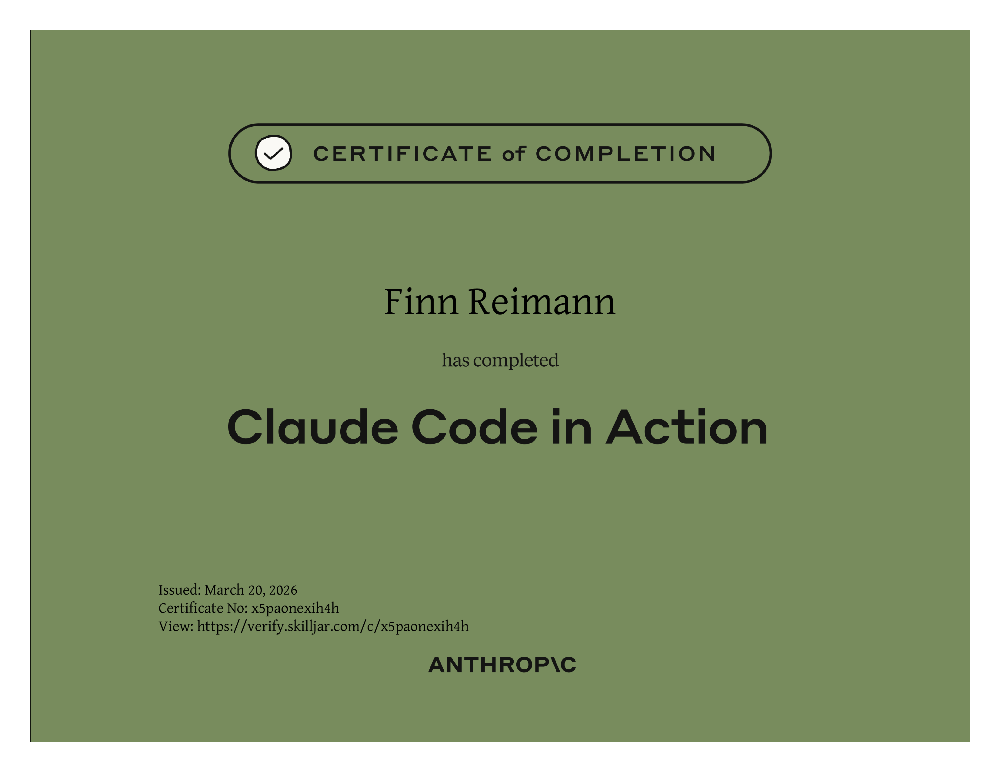
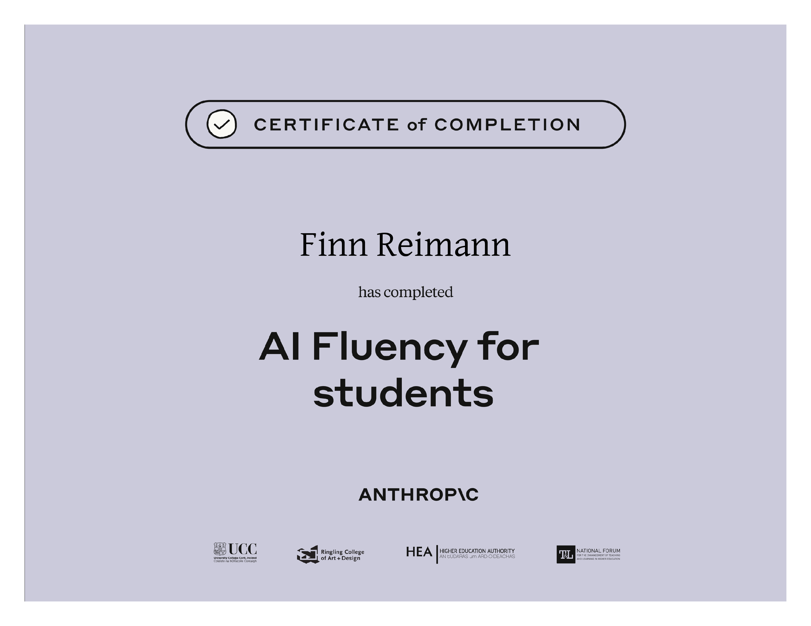
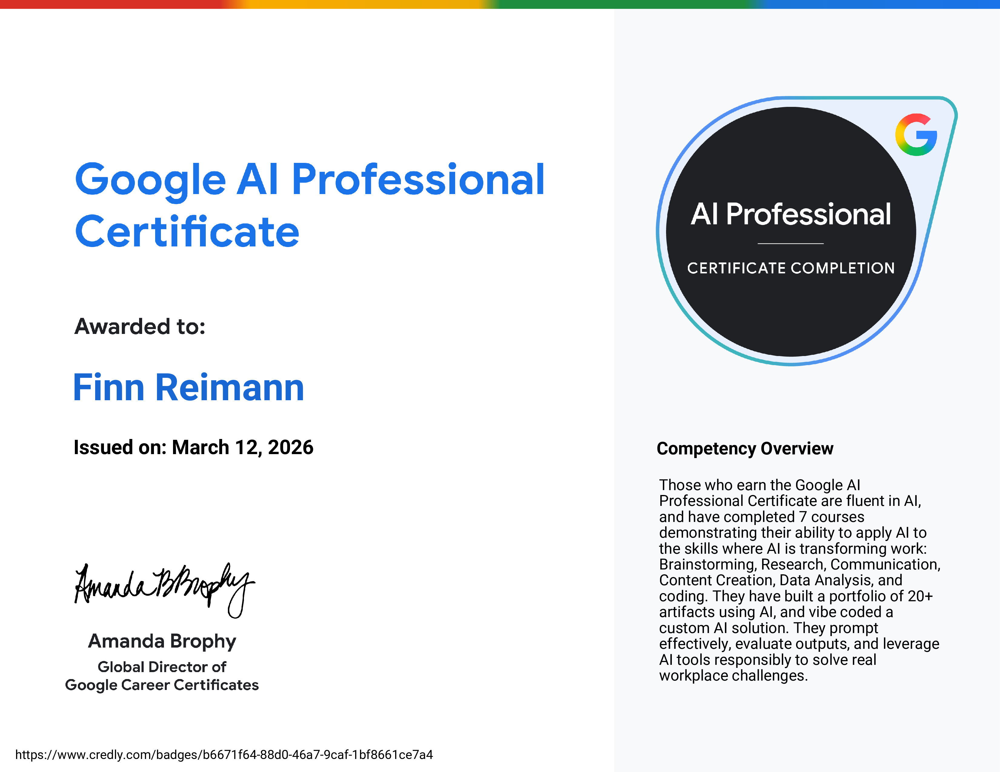
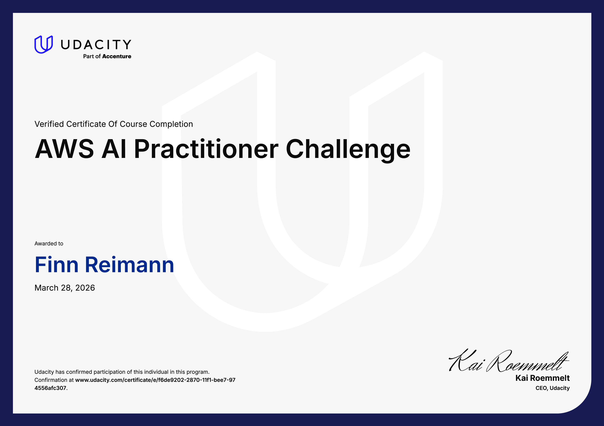
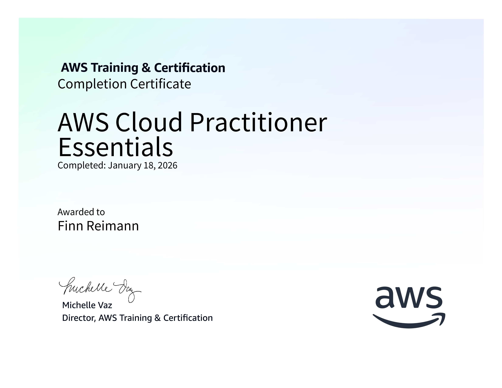

<h1><strong>Finn Reimann</strong></h1>

<h3 align="center"><strong> About Me </strong></h3>
<table border="0" cellpadding="0" cellspacing="0" style="border-collapse: collapse;">
  <tr>
    <td align="center" width="20%">
    
    </td>
     <td align="left" width="60%">
      
CS student at TU Darmstadt and research assistant at the Institut für Bahnsysteme und Bahntechnik, building software where academic research meets real-world infrastructure.  I'm drawn to both ends of the stack... from pixel-perfect UIs to the systems underneath. Outside of work, I'm either at the gym, out on a run, or deep in a side project I probably shouldn't have started.
      

      

        &nbsp;&nbsp;&nbsp;&nbsp;&nbsp;&nbsp;&nbsp;&nbsp;&nbsp;
        <a href="https://finnrmn.com">
        &nbsp;<strong>finnrmn.com</strong>
        </a>
        &nbsp;&nbsp;&nbsp;&nbsp;&nbsp;&nbsp;&nbsp;&nbsp;&nbsp;&nbsp;&nbsp;&nbsp;
        <a href="mailto:finnrmnn@gmail.com">
        &nbsp;<strong>finnrmnn@gmail.com</strong>
        </a>
      

    </td>
  </tr>
</table>

---
<h3 align="center"><strong>Tech Stack</strong></h3>

<table border="0" cellpadding="8" cellspacing="0" style="border-collapse: collapse;">
  <tr>
    <td align="center" width="25%">
      
<strong>Languages</strong>

      &nbsp;&nbsp;
      &nbsp;&nbsp;
      &nbsp;&nbsp;
      
    </td>
    <td align="center" width="25%"> 
      
<strong>Frameworks &amp; Libraries</strong>

      &nbsp;&nbsp;
      &nbsp;&nbsp;
      &nbsp;&nbsp;
      
    </td>
  </tr>
</table>
<table border="0" cellpadding="8" cellspacing="0" style="border-collapse: collapse;">
  <tr>
    <td align="center" width="25%">
      
<strong>Tools &amp; Platforms</strong>

      &nbsp;&nbsp;
      &nbsp;&nbsp;
      &nbsp;&nbsp;
      
    </td>
  </tr>
</table>

---

<h3 align="center"><strong>Certifications</strong></h3>

<table border="0" cellpadding="10" cellspacing="0" style="border-collapse: collapse;">
  <tr>
    <td align="center" width="33%">
      
       <b>Claude Code in Action</b> 
       
      
    </td>
    <td align="center" width="33%">
      
       <b>AI Fluency for students</b> 
       
      
    </td>
    <td align="center" width="33%">
      
       <b>Google AI Professional Certificate</b> 
       
      
    </td>
  </tr>
</table>
<table border="0" cellpadding="8" cellspacing="0" style="border-collapse: collapse;">
  <tr>
    <td align="center" width="25%">
      
       <b>AWS AI Practitioner Challenge</b> 
       &nbsp;
      
    </td>
    <td align="center" width="25%">
      
       <b>Machine Learning Learning Plan</b> 
      
    </td>
    <td align="center" width="25%">
      
       <b>AWS Cloud Practitioner Essentials</b> 
      
    </td>
    <td align="center" width="300">
      
       <b>Machine Learning Specialization</b> 
      
    </td>
  </tr>
</table>

